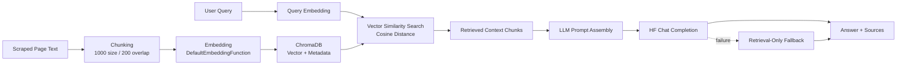
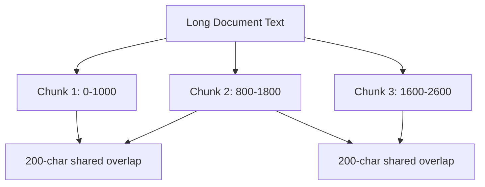
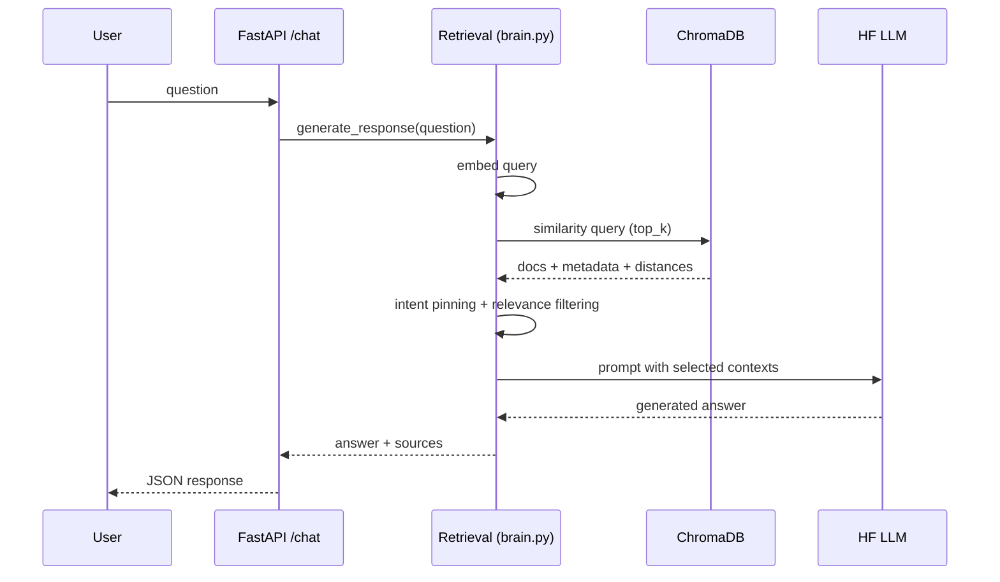

# RBU Assistant Architecture and Technical Decisions

## 1. Objective and Design Philosophy

This project is built as a domain-focused Retrieval-Augmented Generation (RAG) assistant for Ramdeobaba University (RBU). The goal is not a generic chatbot. The goal is:

- high factual grounding from official university pages,
- quick local iteration for development,
- resilient answers even when external LLM API calls fail,
- extensible intent handling for high-frequency student questions (fees, programs, hostel, eligibility, placements).

The system architecture follows a practical pipeline:

1. scrape and normalize website content,
2. chunk and embed content into a local vector store,
3. retrieve relevant chunks per user query,
4. generate final response via remote LLM,
5. fallback to retrieval-based summary if LLM is unavailable.

This architecture balances reliability, speed, and cost.

## Visual Pipeline

## 2. Why Scraping-Based Knowledge Ingestion

### 2.1 What is implemented

The scraper (`backend/scraper.py`) uses:

- `requests` for page fetch,
- `BeautifulSoup` for parsing,
- markdown table extraction for fee-style tabular pages,
- optional OCR path for PDF/images (`pdf2image`, `pytesseract`, `Pillow`),
- controlled text cleanup to reduce boilerplate noise.

### 2.2 Why scraping instead of manual static data

Manual JSON authoring is hard to keep updated and is error-prone for pages that change frequently (admissions, program lists, fees, dates, notices). Scraping keeps the data source anchored to official website content and enables refresh using `/rescrape` and `/scrape-urls`.

### 2.3 Why this parser strategy

- Rule-based cleanup is simple and robust for content-heavy CMS pages.
- Table-to-markdown extraction preserves structured fee rows better than plain flattened text.
- OCR path ensures scanned or image-heavy assets are not fully ignored.

Alternatives considered and tradeoffs:

- Browser automation scraping (Playwright/Selenium): better for JS-heavy pages, but heavier runtime and maintenance overhead.
- Site-specific hand-crafted parsers: high precision, but brittle and expensive to maintain across template changes.
- Third-party content APIs: less engineering effort, but adds external dependency/cost and weaker control over extraction quality.

Given this project scope, current hybrid extraction is a strong cost-performance compromise.

## 3. Why ChromaDB as Local Vector Store

### 3.1 What is implemented

`backend/brain.py` stores chunk embeddings in persistent Chroma collection:

- collection name: `rbu_knowledge`,
- cosine similarity search,
- chunk size 1000 with overlap 200,
- local persistent directory (`backend/rbu_chroma_db/`).

### 3.2 Why vector retrieval

Keyword-only retrieval misses semantically relevant pages when user wording differs from website wording. Vector search improves recall for natural-language variants, typo/noise, and mixed intent phrases.

### 3.3 Why Chroma specifically

- quick setup with Python stack,
- local persistence (works offline after indexing),
- no external vector database provisioning,
- good fit for small-to-medium corpora.

Alternatives and why not chosen:

- FAISS only: very fast ANN, but persistence/metadata workflows are less convenient for this project shape.
- Elastic/OpenSearch vector: strong production capabilities but heavier operational footprint.
- Pinecone/managed vector DB: easy scaling but introduces external billing/network dependency.

Current local development requirements favor Chroma.

## 4. Why This Embedding Approach

### 4.1 Current embedding path

The project uses Chroma default embedding function (ONNX MiniLM family path), avoiding heavy runtime requirements from full transformer stacks in local environments.

### 4.2 Why this over larger embeddings

Large embedding models may improve marginal retrieval quality but increase latency, memory, and deployment complexity. MiniLM-scale embeddings provide a strong baseline for domain-specific QA with much better local performance.

### 4.3 How text is converted to vectors in this project

The conversion path is implemented in `backend/brain.py` and works in two places:

1. document indexing time (`store_documents`),
2. user query time (`retrieve_context`).

At indexing time:

1. raw page text enters `store_documents(documents)`.
2. each document is split by `chunk_text(text, chunk_size=1000, overlap=200)`.
3. all chunk strings are collected in `all_chunks`.
4. `embedder(all_chunks)` is called.
5. embedder returns one dense vector per chunk.
6. vectors are written to Chroma with metadata (`url`, `title`, `chunk_index`).

At query time:

1. user question text enters `retrieve_context(query)`.
2. question text is embedded with `embedder([query])`.
3. Chroma runs nearest-neighbor search in vector space using cosine distance.
4. top matching chunk documents and metadata are returned.

So both documents and user queries are mapped into the same embedding space. Similar meaning results in nearby vectors, which makes semantic retrieval possible.

### 4.4 Which embedding model is used and why

The code uses Chroma's `DefaultEmbeddingFunction()` and keeps `EMBEDDING_MODEL = "sentence-transformers/all-MiniLM-L6-v2"` as reference. In practice this path is optimized for lightweight local usage (ONNX-backed MiniLM route) and avoids heavier full transformer runtime dependencies.

Why this model family is a good fit here:

- strong sentence-level semantic retrieval for FAQ-style university content,
- low latency during indexing and query embedding,
- manageable memory/CPU usage for local Windows development,
- good robustness for common wording variation in student queries.

Why not larger embedding models by default:

- larger vectors increase latency and storage,
- local setup becomes harder,
- benefit is often smaller than gains from better scraping and retrieval routing.

In this project, data quality and intent-aware retrieval contributed more than switching to larger embeddings.

### 4.5 Why overlap is used (chunk_size=1000, overlap=200)

Without overlap, chunk boundaries can split meaning. Example:

- chunk A ends with program name,
- chunk B starts with corresponding fee values.

If a query retrieves only chunk A or only chunk B, answer quality drops.

With overlap:

- each next chunk starts 200 characters before the previous chunk ended,
- boundary information appears in both chunks,
- retrieval has higher chance to capture complete local context.

Mathematically in current code:

- start index increases by `chunk_size - overlap` = `1000 - 200` = `800`.
- chunks are generated over ranges like:
  - `[0:1000]`, `[800:1800]`, `[1600:2600]`, ...

This 20 percent overlap is a practical middle ground:

- too small overlap misses cross-boundary semantics,
- too large overlap creates redundant vectors and slower indexing.

### 4.6 Detailed chunking and indexing program flow

Program flow in `store_documents`:

1. `collection = chroma_client.get_or_create_collection(...)`.
2. loop each scraped document `{url, title, content}`.
3. call `chunks = chunk_text(doc["content"])`.
4. for each chunk:
	- build stable ID: `"{url}__chunk_{i}"`,
	- append chunk text to `all_chunks`,
	- append metadata with URL/title/chunk index.
5. after all documents, compute embeddings in one call: `embeddings = embedder(all_chunks)`.
6. batch write (`batch_size=100`) using `collection.upsert(...)`.

Why batched upsert is used:

- safer memory usage,
- avoids oversized payload writes,
- supports re-indexing same URL with deterministic IDs.

### 4.7 Detailed retrieval flow from vectors to answer context

Program flow in `retrieve_context` and `generate_response`:

1. embed query text with same embedder.
2. run `collection.query(query_embeddings=..., include=[documents, metadatas, distances])`.
3. convert result rows into context objects:
	- `text`, `url`, `title`, `distance`.
4. apply intent-aware context pinning (fees/programs/hostel).
5. remove excluded URL families.
6. apply relevance filtering:
	- token overlap,
	- fuzzy token overlap,
	- distance threshold fallback.
7. pass resulting contexts into prompt for LLM generation.
8. if LLM fails, synthesize answer from retrieved contexts directly.

This is the core reason the system remains useful under both normal and degraded LLM conditions.

## 5. Why RAG + Remote LLM Instead of Fine-Tuning

### 5.1 RAG advantages here

- immediate knowledge updates after scraping,
- no retraining pipeline needed when pages change,
- explicit source traces from retrieved chunks,
- lower complexity for an evolving institutional FAQ system.

### 5.2 Why Hugging Face Router endpoint

- easy model swap via `HF_MODEL`,
- standard chat-completions API shape,
- operational simplicity with token-based access.

### 5.3 Why fallback mode was implemented

External LLM calls can fail (DNS, timeout, provider outage, auth errors). Returning raw exception text hurts UX. So fallback was added to build retrieval-only answers from relevant chunks.

This provides graceful degradation:

- no hard outage for users,
- still source-grounded results,
- clearer resilience in production-like conditions.

## 6. Why Query Intent Routing Exists

Certain high-impact intents benefit from specialized retrieval behavior:

- fees queries: broader context, fee URL pinning, larger token budget,
- programs queries: program-list URL pinning and grouped output instructions,
- hostel fee queries: hostel-specific pinning to avoid accidental suppression by generic fee filters,
- overview/generic asks: broad fallback to avoid strict lexical filter dropouts.

This is not a full intent-classification model. It is a practical hybrid of heuristic intent flags and vector retrieval.

Why heuristic routing over ML intent classifier:

- transparent behavior,
- low latency and no training data needed,
- easy tuning from production feedback.

## 7. Why Mandatory Policy Router in `main.py`

`_detect_mandatory_case()` and fixed responses exist for cases where deterministic policy handling is preferable before RAG:

- comparison requests,
- admission guarantee asks,
- privacy-sensitive asks,
- financial bargaining asks,
- future speculation,
- off-topic/irrelevant queries,
- transaction simulation requests.

This keeps safety and messaging consistent and testable via `backend/test_policy_router.py`.

## 8. Data Quality and Source Governance Decisions

### 8.1 Source exclusions

Project currently excludes specific governance/person pages (`/deans/`, `/directors/`, `/team-cdpc/`) from retrieval/sources based on user requirements.

This is implemented as URL-level filtering to guarantee those sources do not appear even if older vectors exist.

### 8.2 Targeted reindexing support

`/scrape-urls` enables incremental updates when a known page changes (for example `program-list/`, `fees-structure/`).

This avoids full corpus rebuild and supports fast correction cycles.

## 9. Why These API Boundaries

Backend endpoints are intentionally minimal:

- `/chat`: primary interaction surface,
- `/stats`: readiness and chunk count,
- `/health`: liveness,
- `/scrape-status`: background ingestion visibility,
- `/rescrape` and `/scrape-urls`: operational refresh controls,
- `/chat-policy-test`: deterministic policy debugging.

This keeps frontend integration simple while preserving operability for data refresh and troubleshooting.

## 10. Operational Tradeoffs and Future Improvements

Current tradeoffs:

- heuristic parsing can still include noisy lines on some pages,
- heuristic intent routing can over/under-trigger on edge phrasings,
- response formatting can contain duplicates when source pages overlap heavily.

Recommended next improvements:

1. Add dedup + normalization post-processing for list-style answers.
2. Add optional reranker stage for top retrieved contexts.
3. Add source-priority weights per intent (fees/programs/hostel).
4. Add snapshot tests for key prompt classes (fees, programs, hostel, overview).
5. Add structured response modes (table JSON + plain text render).

## 11. Summary

The current architecture is a pragmatic, production-aware RAG stack optimized for:

- local deployability,
- explainability,
- resilience,
- fast iterative fixes from real user prompts.

Scraping + vector retrieval + remote LLM + fallback mode is the right balance for this use case, and intent-based retrieval tuning is the key mechanism that improved answer completeness for fees, programs, and hostel scenarios.
